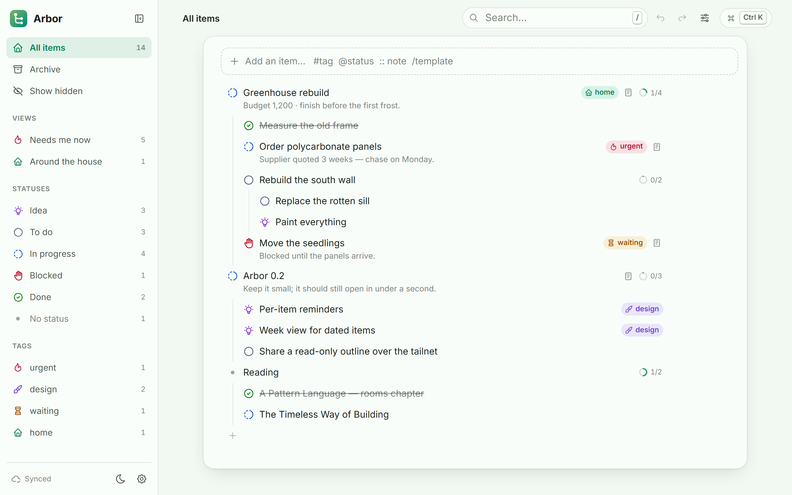
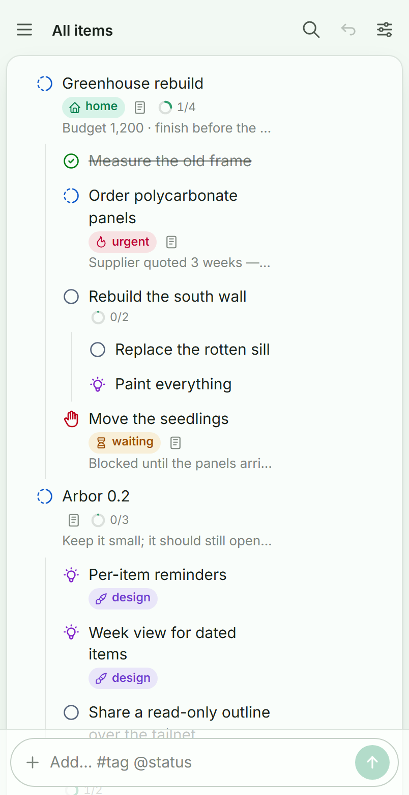

# Arbor

Arbor is a small self-hosted tracker for the projects you actually run: nested items to any depth,
statuses and tags you define yourself (any of 6,200 icons or 1,900 emoji, any colour), a note under
anything, and a phone app that keeps working when the signal drops. One Node process, one SQLite
file, no accounts, no cloud.



## What it does

- **Entry with no friction.** Type in the add box and press Enter. `#tag` tags it (new names create
  the tag), `@status` sets a status, ` :: ` starts a note, `/template` builds a whole sub-tree, and
  Tab nests the next item under the last one. Paste an indented or bulleted list and it becomes an
  outline.
- **Outliner editing.** Enter makes the next item (splitting the text at the cursor), Tab and
  Shift+Tab change nesting, Backspace at the start merges into the row above, Ctrl+Enter marks done,
  Alt+1…9 picks a status. Drag an item by its status icon; dragging sideways changes its depth.
- **Statuses and tags you define.** Any name, any colour, any icon from the full Tabler set
  (outline and filled) or an emoji. Mark the statuses that mean *finished* and they drive progress
  rings, "hide done" and Ctrl+Enter.
- **Notes.** Markdown, with links and checklists you can tick straight in the outline.
- **Hide and archive, separately.** Hidden items stay where they are but out of sight until you ask
  for them; archived items move to the Archive with their sub-items and can be restored.
- **Bulk edits.** Ctrl-click, Shift-click, Shift+arrows or long-press to select, then set status,
  add or remove tags, move, hide, archive or delete in one go.
- **Saved views.** Keep a search, its filters, the hidden/done toggles and the item you zoomed into
  as a named view in the sidebar, with a live count.
- **Templates.** Save any item and its sub-items as a template; drop copies in with `/name`.
  `{name}`, `{date}`, `{weekday}`, `{week}` and friends are filled in when it is used.
- **Offline.** Installed on a phone it opens and edits offline; changes queue locally and are sent
  when the connection returns — the service worker sends them even if you closed the app.
- **Yours to look at.** Ten themes, accent colour, tint hue and strength, backgrounds, frosted
  glass, five bundled fonts, text size, density, indent width, row details, dark/light/auto, and a
  custom CSS box. Every device can follow the shared look or keep its own.
- **Undo everything.** Every change — including bulk edits, moves and deletes — is one Ctrl+Z away.



## Try it

Node 22.13 or newer (it uses the built-in SQLite).

```sh
git clone https://github.com/vaynealtapascine/Arbor.git
cd Arbor
npm install
npm run dev
```

Open <http://localhost:5241>. The dev API runs on 5244 with its data in `data-dev/`, so it never
collides with an installed service on 5240. The app seeds a few statuses, tags and a short tour on
first run; archive or delete it when you're done.

## Run it for real

Arbor is one process listening on localhost, meant to sit behind something that does HTTPS. My
setup is Windows + [Caddy](https://caddyserver.com) + [Tailscale](https://tailscale.com), so the
phone reaches it privately, and that is what the included scripts automate:

```sh
npm run deploy                       # builds and copies into %USERPROFILE%\selfhost\arbor
```

then double-click `selfhost\arbor\install.cmd` once and accept the administrator prompt.
(`check.cmd` reports what it would do and changes nothing.) It registers a Windows service
(NSSM, starts with Windows, restarts on crash), offers to set a passcode, adds the site to your
Caddyfile, reloads Caddy, and tells you the DNS record to add. Later deploys are just
`npm run deploy` — the client updates immediately and the server restarts itself.

Anywhere else, run the server directly behind your own proxy:

```sh
npm run build
ARBOR_PORT=5240 ARBOR_HOST=127.0.0.1 ARBOR_DATA=/var/lib/arbor ARBOR_PASSCODE=secret npm start
```

| Variable | Default | What it does |
| --- | --- | --- |
| `ARBOR_PORT` | `5240` | Port to listen on |
| `ARBOR_HOST` | `127.0.0.1` | Interface to bind |
| `ARBOR_DATA` | `./data` | `arbor.sqlite`, `backups/` (one a day, 14 kept) |
| `ARBOR_STATIC` | `./dist` | Built client to serve |
| `ARBOR_PASSCODE` | *(unset)* | Asked once per device, then remembered in a cookie |
| `ARBOR_PASSCODE_HASH` | *(unset)* | sha256 of the passcode instead, so the passcode is stored nowhere (what setup uses) |
| `ARBOR_RESTART_ON_CHANGE` | *(unset)* | `1`: exit when the server code changes, for deploys under a service manager |

On the phone: open the site in Chrome and use *Add to Home screen*. It then opens full-screen,
starts offline and syncs when it can.

## Keyboard

Press <kbd>?</kbd> in the app for the full list. The ones worth knowing:

| Key | Does |
| --- | --- |
| <kbd>Enter</kbd> | Next item (splits at the cursor) |
| <kbd>Tab</kbd> / <kbd>Shift+Tab</kbd> | Indent / outdent |
| <kbd>Shift+Enter</kbd> | Open the note |
| <kbd>Ctrl+Enter</kbd> | Toggle done |
| <kbd>Alt+1…9</kbd> | Set status (<kbd>Alt+0</kbd> clears) |
| <kbd>Ctrl+K</kbd> | Commands, views, templates, jump to any item |
| <kbd>/</kbd> | Search |
| <kbd>Z</kbd> / <kbd>Shift+Z</kbd> | Zoom into an item / back out |
| <kbd>H</kbd>, <kbd>A</kbd> | Hide, archive |
| <kbd>Ctrl+Z</kbd> | Undo (everything is undoable) |

## How it works

The server keeps every item, status, tag, view, template and setting as a JSON document in one
SQLite table with a global revision number. Clients ask for "everything since revision N", get new
revisions pushed over server-sent events, and fall back to a full snapshot if they have been away
longer than the tombstones are kept (45 days).

Each client holds the confirmed state plus its own queued writes in IndexedDB, so edits appear
instantly, survive a restart and go out when the server is reachable. Writes are field-level
patches, so two devices editing different fields of the same item both win; the same field resolves
last-write-wins. Moves that would create a loop (possible when two devices reparent offline) are
detected and broken so nothing disappears.

```
server/         HTTP + SQLite document store (no runtime dependencies)
src/lib/        replica and sync, tree model, actions with undo, parsing, views, templates
src/components/ the interface
deploy/         Windows service + Caddy setup
```

## Development

```sh
npm run check   # svelte-check and the service worker's types
npm test        # unit tests plus the server's own tests
npm run build   # icon catalogues, client bundle, service worker
```

## Licence

[MIT](LICENSE).
